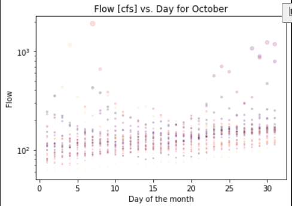
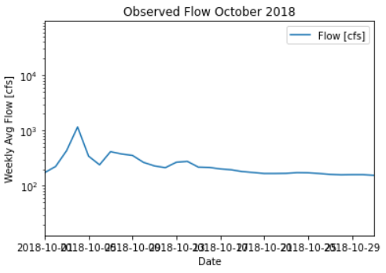

# Week 7 Code Instructions - Steph Serrano

**Instructions on how to run code:**
The instructions are not too complex! Just make sure the language is set to Python and run the cells in the order that they are appear in the script! Thank you!

---
# Code Review:
**Week 1 Forecast:**
161.0
**Week 2 Forecast:**
176.0
**Printed Info From Script:**
Iteration 0 Day= 11 Flow= 161.0

[161.]

Week 1 Forecast Summary: 
    
    This is going to give the median for a given day for a given year. Originally, this loop had an array for 31 days.
    I changed the range and storage to only provide data for one specific day in an overly complicated way.
    I am using the flow for October 11th, 2018 as my Week 2 Forecast because I have some thought that the year 2018 is similar, in terms of "wetness", to our current year. I am specifically using the 11th because USGS will update the flow Oct. 11th, 2021.

Iteration 0 Day= 18 Flow= 176.0

[176.]

Week 2 Forecast Summary: 
    
    Week 2 has similar reasoning as above except I used the Week 2 date (October 18th) for the year 2018 for my Week 2 forecast.
    This is why the daytemp = x+18.
**Plots:**
  
  
 1](../../images/4f4be30bf428204d627182c712897f919aa00ee0532af23d6f81ddcd71d26844.png)  
  
**Code Review:**
1. *Is the script easy to read and understand?*

This script is very easy to read, but I would recommend adding more comments to your functions. As an outsider looking in, it was difficult to follow along and intuit what the variables/inputs were. 

That being said, the docstring had all of that information so I would suggest parsing out that info and adding it sequentially as comments throughout the function's workflow.

[4/5]

2. *Does the code follow PEP8 style consistently?*

Absolutely! Easy to read.

[5/5]

3. *Is the code written succinctly and efficiently?*

Yes, the code is written nicely. I wonder if the three plot *run cells* could be combined into one function with the a **month** parameter since all of the data analyze October flows. Just a thought, but I think this was an effecient script.

[5/5]