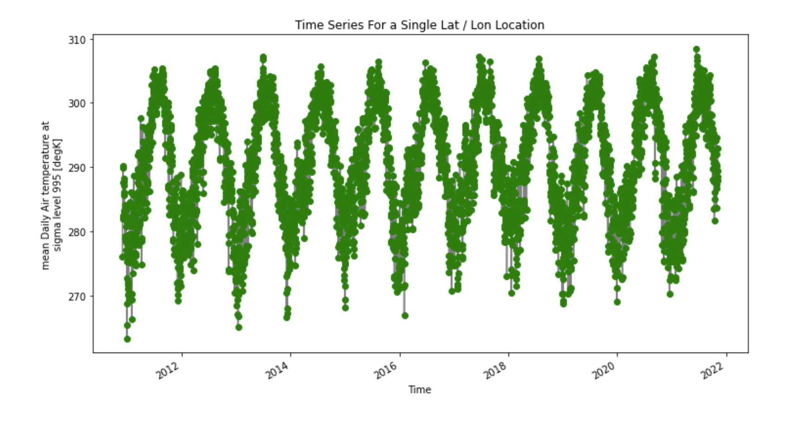
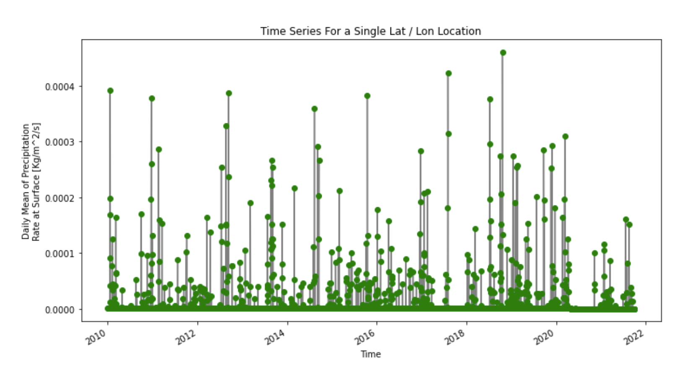
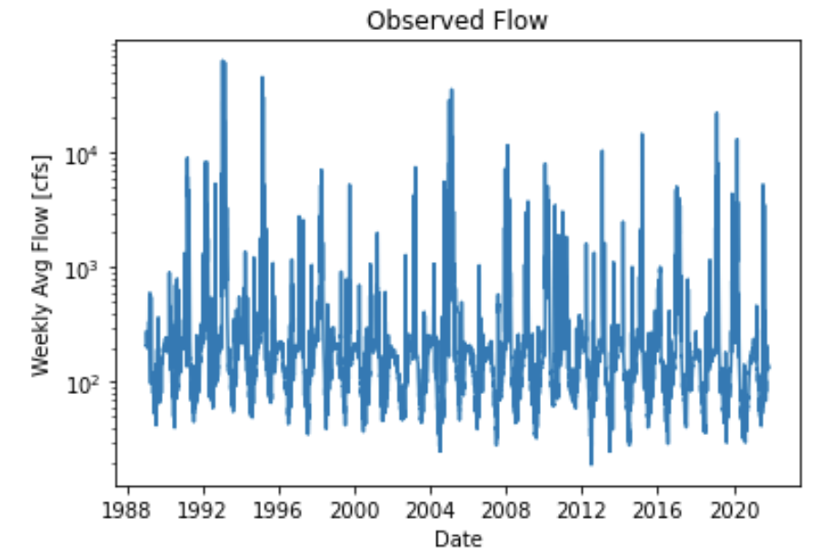
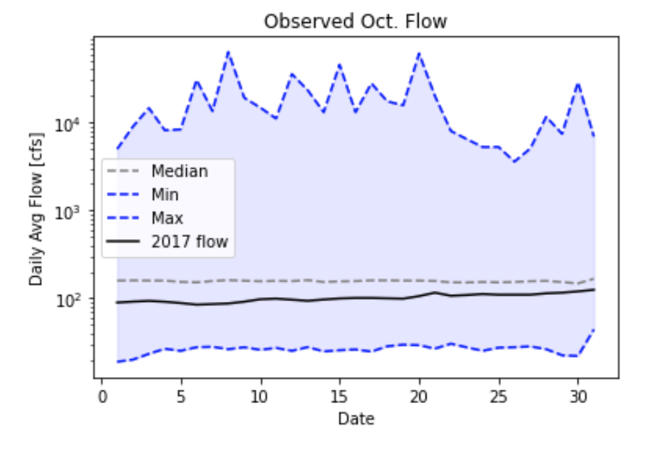

### Stephanie Serrano
**November 8th, 2021**

**Assignment #11**
_____
### Grade
3/3 - Nice work. FYI for the spatial resolution and extent question I was asking what is the size of each grid cell and the total spatial area that was covered. You can see more about how to answer that in the starter code. 
____

A brief summary of the how you chose to generate your forecast this week.
A description of the dataset you added
What is the dataset? Why did you choose it?
What is the spatial and temporal resolution and extent of the data ?
Where did you get the data from?
What was your approach to extracting and aggregating it into something useful to you?
A plot of the dataset you added. This can be a timeseries, map, histogram or any other plot that you think is a good summary of what you added.

1. A brief summary of how you chose to generate your forecast this week.
  - Regarding the streamflow, I plotted the data similarly to before where I could view the various trends and try to deduce a pattern from that plot. I added two different NetCDF files from NOAA for Reanalysis Daily Average Data. The first was the Precipitation Rate while the second was the Air Temperature. For the first week, I predict that the flow rate will be **135 CFS** and the second week will be **120 CFS**.

2. A description of the dataset you added:
  - What is the data set and why did you choose it?
    - I did look at the Precipitation Rate dataset with modifications in class because I feel that precipitation plays an important part in the streamflow but that was the example we were using in class. The other dataset that I looked at was Air Temperature because, at least in my mind, the colder it gets, the more chance of snow in the northern part of AZ and snowmelt tends to be a big deal with rivers here.
  - What is the spatial and temporal resolution and extent of the data?
    - The air temperature had 1 lat, 1 lon, and 3993 different dates.
  - Where did you get the data from?
    - I got the data from PSL NOAA: https://psl.noaa.gov/cgi-bin/db_search/SearchMenus.pl
  - What is was your approach to extracting and aggregating it into something useful to you?
    - My approach was to create a grid using the coordinates that I thought were around the Verde watershed area. Then, I only used data from 2010 to the present day.

  - Plot Images:
    - Air Temp:
      
    - Precipitation Rate:
      
    - Observed Stream Flow:
      
      
