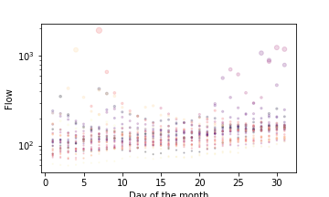
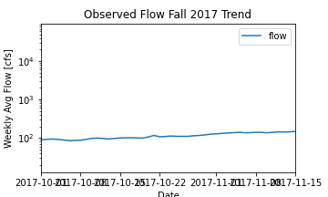
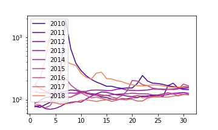

### Stephanie Serrano
**September 26th, 2021**

**Assignment #8**

For the first week, I predict that the flow will be **155** cfs. Looking at the trends over the years, the streamflow seems to become consistent around 150-160 cfs after October 15th and remain that way until the end of the month. Snowmelt does seem to play a large part in affecting the streamflow data but I do not think that the snow in the surrounding areas (i.e. Flagstaff) will be melting enough to make a difference any time soon (This may be the most incorrect way to look at it, I do not understand how snow really works in the hydrological system 100% yet). The "trends" I looked at came from a scatterplot of October flow and general observed flow values for October over time. Similarly, because I do not think any other external event will be happening, I think the flow will drop down to **140** cfs the second week. 

These were the three plots I looked at to make my predictions:

