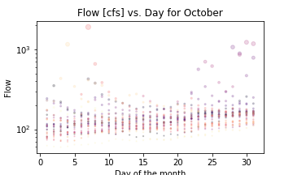
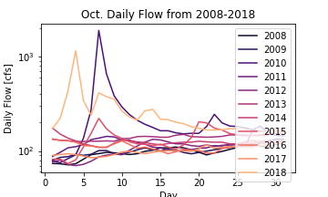
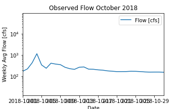

### Stephanie Serrano
**September 26th, 2021**

**Assignment #8**

1. An explanation of how you generated your forecasts and why?
  - I generated my forecasts using a function that would pull out the flow value from a specific time in a year. I used October 18th, 2018 for the first week prediction and October 25th, 2018 for the second week. I chose the year 2018 because it was a weird "water year" similarly to how this year has been more "wet" in comparison to the last few years. The dates I chose were just the dates the streamflow predictions fall on this year.

2. The three graphs you are including with an explanation of why you chose these three graphs.
  - I chose a scatterplot, a daily flow, and a general time series of observed flow because that allows me to look at the trends that have occurred in previous years for the month of October and what the current trend seems to be as we begin to approach the end of the month.

3. A brief summary of what you got out of the peer evaluation. How did you make your script better based on the feedback you received?
  - The feedback I received reassured me that not everything I was doing was incorrect. Although there were many kind words in the evaluation, I wish there had been more suggestions as to what I could have added/changed to make my script more efficient or better although I understand that it is difficult to give coding advice. It was not until we did a peer-review in class did I learn there were some things I needed to change.

4. A summary of how you are using timeseries functionality in your script.
  - I used the timeseries functionality to plot the flow trend for the month of October in the year 2018.

5. Describe the part of your script that you are most proud of and why
  - I am just proud that I was able to figure out how to get a value to print out and the summary that I had included.
