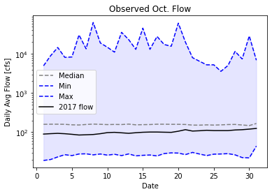
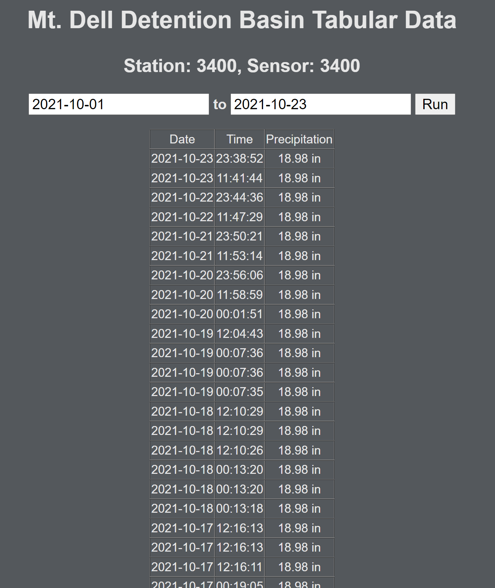

### Stephanie Serrano
**October 25th, 2021**

**Assignment #9**

1. A brief summary of the how you chose to generate your forecast this week.
  - I chose to generate my forecast this week by selecting a value that fit the trends on the plot I looked at as well as recent precipitation values in Flagstaff (rather than Prescott). It had been a little rainy (and snow had fallen two weeks ago) so I assumed the values would be a little higher at **100 cfs** for the first week and **85 cfs** for the second week. The second week is lower because the trend seems to go downward for a moment in October for previous years and the weather seems to be clear.

2. A description of the dataset you added
  - What is the dataset? Why did you choose it?
    - The dataset I was attempting to choose was daily precipitation so far for the month of October but I could not get it to work and unfortunately did not have enough time to try to figure it out for the grade. I accept the loss of points for the week. Although I had tried using Mesonet with an API key, I could not get that to work either. At least with the Flagstaff data, I could make a guess with the data in front of me, even if it was not necessarily in the code like it should have been.
  - What location have you chosen?
    - The location was the Mt. Dell Detention Basin in Flagstaff, Arizona.
  - Where did you get the data from?
    - I was trying to grab the data from rain.flagstaffaz.gov website. It did not work out.
  - What was your approach to accessing it?
    - I was able to open the data into a separate website in tabular data form that I linked on my code but I think the part that I struggled with was formatting the data into a DataFrame which is why I could not get a functioning graph or even values to work with.

3. A plot of your additional time series along with your streamflow time series.
  -  

4. A plot that illustrates how you chose your forecast values.
- This is a screen-capture of the data I was referring to in the second question that I was using as a basis for precipitation estimations.
- 
